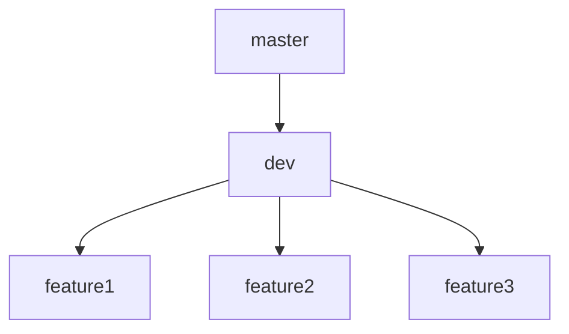

# GitHub Workflow

## Commits Namming Convention

**Template:** `<commit-type>:<commit-title>`
**Commit Types:**

- feat: Add new feature or user functionality
- fix: Resolve a bug or issue encountered
- chore: Routine tasks, no feature or fix
- test: Add or update tests for code
- refactor: Improve code structure without changing behavior
- revert: Undo changes by creating a reverse commit.
- merge: use it for merge commits

> Example: feat: payment gateway

> Note: Try to type a convenient commit message to explain things that are changed/updated/fixed and so on...

## Branches Namming Convention

**Template:** `<branch-type>/<sprint-number>/<branch-title>`
**Branch Types:**

- feature: Add new features or enhancements.
- fix: Patch known issues or regressions
- refactor: Clean up, optimize, or restructure code.
  **Ticket Number:** Can be the id of a GitHub issue or Clickup task.
  **Branch Title:** Just name it a convenient title.

> Example: feature/12346/dashboard

## Branches Merge Flow

## Versions Releasing

After merging dev branch with the master create a release from GitHub GUI named after the version number which follows the [semantic versioning](https://semver.org/).

## Notes

- To pull a branch from another branch skip the unneeded overhead of rebase using that command: `git pull --no-rebase origin <a-remote-branch>`.

## Pull Requests Namming

Just name it after the name of the current branch.

## Documentation

- If uncommon thing is done just type a documentaiton for it inside the react component itself or/and inside /docs directory.
- Install [this vs code plugin](https://marketplace.visualstudio.com/items?itemName=MermaidChart.vscode-mermaid-chart) to view mermaid diagrams inside readme files.
